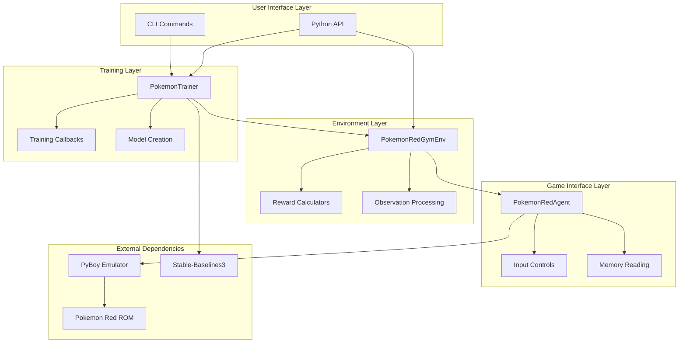
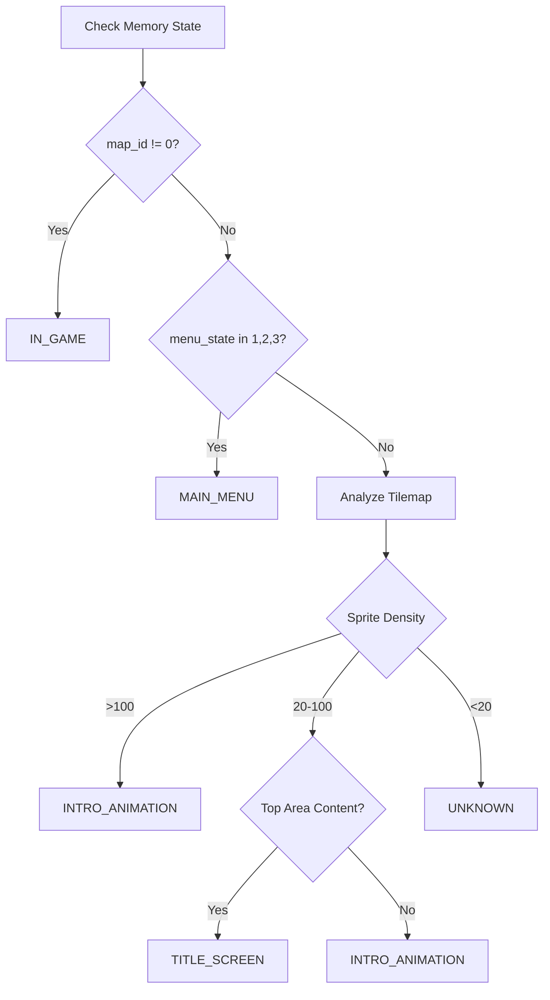
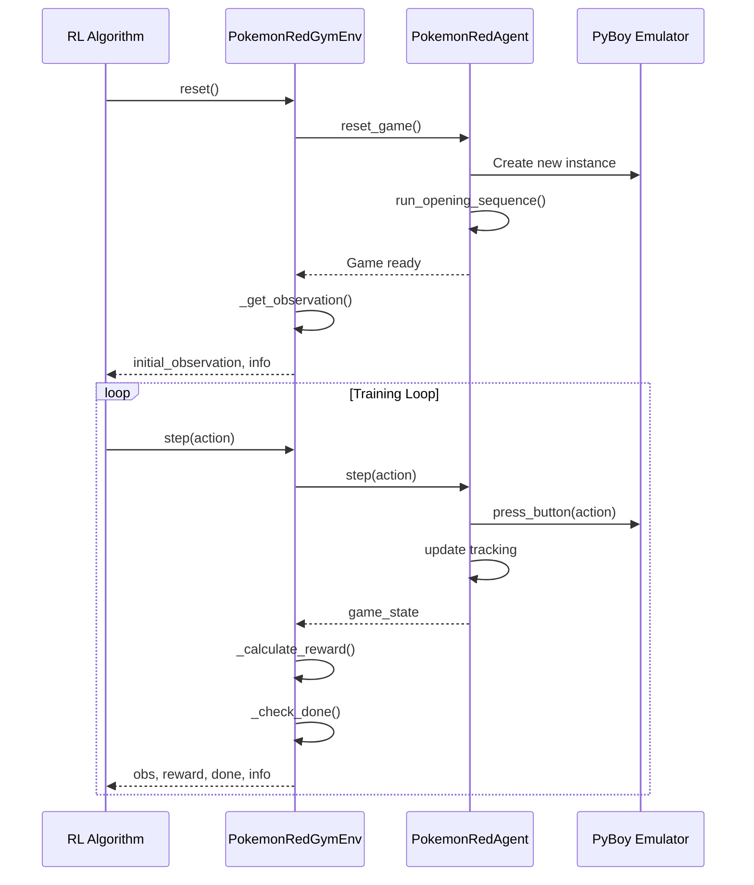
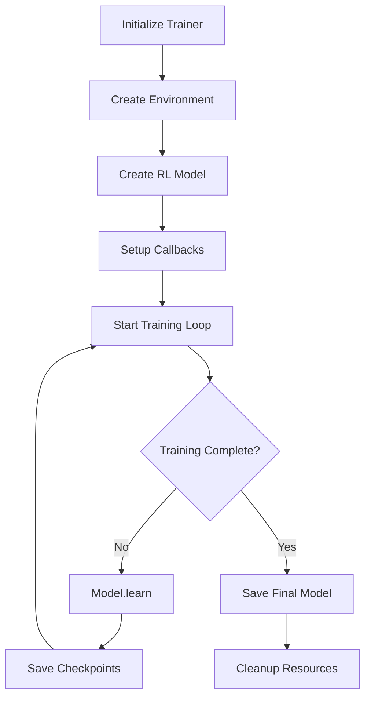
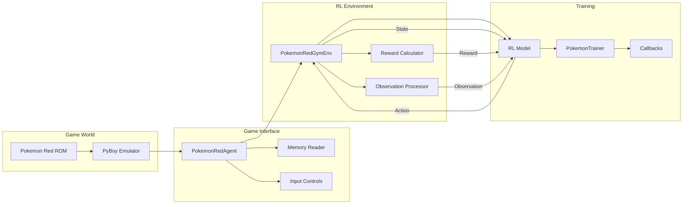

# Pokemon Red AI - Developer Guide

Welcome to the Pokemon Red AI developer guide! This document provides comprehensive information about the codebase architecture, design patterns, and development practices to help you contribute effectively to the project.

## 📋 Table of Contents

- [Project Overview](#project-overview)
- [Architecture Overview](#architecture-overview)
- [Core Components](#core-components)
- [Design Patterns](#design-patterns)
- [Data Flow](#data-flow)
- [Testing Strategy](#testing-strategy)
- [Development Setup](#development-setup)
- [Contributing Guidelines](#contributing-guidelines)
- [API Reference](#api-reference)

## 🎯 Project Overview

Pokemon Red AI is a comprehensive reinforcement learning toolkit for training AI agents to play Pokemon Red using PyBoy emulation. The project follows a modular, layered architecture that separates concerns and provides clean interfaces between components.

### Key Design Principles

1. **Modularity**: Each component has a single responsibility and well-defined interfaces
2. **Flexibility**: Multiple reward strategies, observation types, and training algorithms
3. **Robustness**: Comprehensive error handling and fallback mechanisms
4. **Testability**: Extensive unit and integration tests with mocking
5. **Extensibility**: Easy to add new features without breaking existing functionality

## 🏗️ Architecture Overview

The project follows a layered architecture pattern:



### Directory Structure

```
pokemon_red_ai/
├── cli/                    # Command-line interface
│   ├── commands.py         # Click-based CLI commands
│   └── __init__.py
├── environment/            # RL environment components
│   ├── gym_env.py         # Gymnasium environment wrapper
│   ├── rewards.py         # Reward calculation strategies
│   ├── observations.py    # Observation processing
│   └── __init__.py
├── game/                   # Game interface components
│   ├── agent.py           # Main Pokemon Red agent
│   ├── controls.py        # Input controls and screen detection
│   ├── memory.py          # Memory addresses and state reading
│   └── __init__.py
├── training/              # Training infrastructure
│   ├── trainer.py         # Main trainer orchestration
│   ├── callbacks.py       # Training callbacks and monitoring
│   ├── models.py          # Model creation utilities
│   └── __init__.py
├── utils/                 # Utility functions
│   ├── config.py          # Configuration management
│   ├── file_utils.py      # File operations and utilities
│   └── __init__.py
└── __init__.py            # Package initialization
```

## 🔧 Core Components

### 1. Game Interface Layer (`pokemon_red_ai.game`)

The lowest layer that directly interfaces with the PyBoy emulator.

#### PokemonRedAgent (`agent.py`)

The main game interface class that manages PyBoy emulation and game automation.

**Key Responsibilities:**
- PyBoy initialization and lifecycle management
- Game automation (intro sequence, opening setup)
- Button input handling with compatibility layers
- Screen and game state reading
- Episode management for RL training

**Key Methods:**
```python
class PokemonRedAgent:
    def __init__(self, rom_path: str, show_window: bool = True)
    def press_button(self, button: str, hold_frames: int = 10)
    def get_comprehensive_state(self) -> Dict[str, Any]
    def run_opening_sequence(self) -> bool
    def reset_game(self) -> bool
    def step(self, action: str) -> Dict[str, Any]
```

#### Controls (`controls.py`)

Handles Game Boy input controls and screen type detection.

**Key Features:**
- Multi-version PyBoy compatibility (1.x and 2.x)
- Screen type detection using memory analysis and tilemap inspection
- Smart button pressing with fallback mechanisms
- Automated navigation helpers

**Screen Detection Logic:**


#### Memory (`memory.py`)

Defines Pokemon Red memory addresses and provides safe memory reading utilities.

**Key Features:**
- Well-documented memory address constants
- Safe memory reading with error handling
- 8-bit and 16-bit value reading
- Game state calculation utilities

### 2. Environment Layer (`pokemon_red_ai.environment`)

Provides the RL environment interface following OpenAI Gymnasium standards.

#### PokemonRedGymEnv (`gym_env.py`)

The main RL environment that wraps the game agent.

**Key Features:**
- Standard Gymnasium interface (`step`, `reset`, `render`)
- Multi-modal observations (screen, position, stats, exploration)
- Configurable reward strategies
- Episode management and termination logic

**Environment Lifecycle:**


#### Reward System (`rewards.py`)

Flexible reward calculation system with multiple strategies.

**Reward Strategies:**
- **Standard**: Balanced approach for general gameplay
- **Exploration**: Heavy emphasis on map discovery
- **Progress**: Focused on story advancement and badges
- **Sparse**: Only major achievements (advanced RL algorithms)

**Reward Calculator Pattern:**
```python
class BaseRewardCalculator(ABC):
    @abstractmethod
    def calculate_reward(self, current_state: Dict[str, Any]) -> float:
        pass
    
    def reset(self) -> None:
        pass
```

#### Observation Processing (`observations.py`)

Handles game state conversion to RL-compatible observations.

**Observation Types:**
- **Multi-modal**: Screen + position + stats + exploration data
- **Screen-only**: Only visual information
- **Minimal**: Compact feature vector for fast training

### 3. Training Layer (`pokemon_red_ai.training`)

High-level training orchestration and monitoring.

#### PokemonTrainer (`trainer.py`)

Main training orchestration class that coordinates all components.

**Training Flow:**


#### Callbacks (`callbacks.py`)

Training monitoring and control callbacks.

**Callback Types:**
- **TrainingCallback**: Basic progress tracking and model saving
- **EnhancedTrainingCallback**: Live plotting and detailed metrics
- **EarlyStopping**: Automatic training termination
- **PerformanceMonitor**: System resource monitoring

#### Model Creation (`models.py`)

RL model creation and configuration utilities.

**Features:**
- Algorithm-specific hyperparameter defaults
- Custom feature extractors for multi-modal observations
- PyTorch neural network architectures
- Hyperparameter optimization support

### 4. User Interface Layer

#### CLI (`pokemon_red_ai.cli`)

Rich command-line interface using Click and Rich libraries.

**Commands:**
- `train`: Train a new model
- `test`: Evaluate a trained model
- `info`: Project information and analysis
- `config`: Configuration management
- `init`: Initialize new projects
- `doctor`: System health checks

## 🎨 Design Patterns

### 1. Strategy Pattern

Used extensively for reward calculation and observation processing:

```python
# Reward strategies
reward_calculator = create_reward_calculator("exploration")

# Observation strategies  
env = PokemonRedGymEnv(observation_type="multi_modal")
```

### 2. Factory Pattern

For creating models and components:

```python
def create_model(algorithm: str, env: gym.Env, **kwargs):
    creators = {
        'PPO': create_ppo_model,
        'A2C': create_a2c_model,
        'DQN': create_dqn_model
    }
    return creators[algorithm](env, **kwargs)
```

### 3. Observer Pattern

Training callbacks observe training progress:

```python
class TrainingCallback(BaseCallback):
    def _on_rollout_end(self) -> None:
        # React to training events
        if self.model.ep_info_buffer:
            self.update_statistics()
```

### 4. Template Method Pattern

Base classes define workflow, subclasses implement specifics:

```python
class BaseRewardCalculator(ABC):
    def calculate_reward(self, state):
        # Template method
        self.reward_components.clear()
        reward = self._calculate_base_reward(state)
        reward += self._calculate_bonus_rewards(state)
        return reward
```

### 5. Adapter Pattern

PyBoy compatibility layer adapts different API versions:

```python
def press_button_basic(pyboy, button: str):
    try:
        # PyBoy 2.x API
        pyboy.button_press(button_id)
    except AttributeError:
        # PyBoy 1.x API fallback
        pyboy.send_input(button_id)
```

## 🔄 Data Flow

### Training Data Flow



### State Information Flow

1. **Raw Game State**: PyBoy provides screen pixels and memory access
2. **Parsed State**: Agent extracts position, stats, game flags
3. **RL Observation**: Environment converts to ML-friendly format
4. **Reward Signal**: Reward calculator provides learning signal
5. **Action**: RL model outputs button press
6. **Game Response**: PyBoy executes action and updates state

## 🧪 Testing Strategy

### Test Organization

```
tests/
├── conftest.py              # Global fixtures and configuration
├── unit/                    # Unit tests for individual components
│   ├── agent/              # Game interface tests
│   │   ├── conftest.py     # Agent-specific fixtures
│   │   ├── test_agent.py   # PokemonRedAgent tests
│   │   ├── test_controls.py # Controls and input tests
│   │   └── test_memory.py  # Memory reading tests
│   ├── environment/        # Environment layer tests
│   ├── training/           # Training components tests
│   └── utils/              # Utility function tests
└── integration/            # Integration and end-to-end tests
```

### Testing Patterns

#### 1. Mock-Based Testing

Heavy use of mocks for external dependencies:

```python
@pytest.fixture
def mock_pyboy():
    mock = Mock()
    mock.memory = Mock()
    mock.screen = Mock()
    mock.button_press = Mock()
    return mock
```

#### 2. Fixture-Based State

Reusable game state fixtures:

```python
@pytest.fixture
def sample_memory_state():
    return {
        'player_x': 5,
        'player_y': 7,
        'map_id': 1,
        'player_level': 15,
        # ... more state
    }
```

#### 3. Parameterized Testing

Testing multiple scenarios efficiently:

```python
@pytest.mark.parametrize("action", ['A', 'B', 'UP', 'DOWN'])
def test_step_with_all_actions(mock_agent, action):
    state = mock_agent.step(action)
    assert isinstance(state, dict)
```

#### 4. Performance Testing

Benchmark critical paths:

```python
def test_agent_step_performance(benchmark_runner):
    def step_op():
        agent.step('RIGHT')
    
    result = benchmark_runner.run('step', step_op, iterations=100)
    assert result['mean'] < 0.05  # Under 50ms
```

## 💻 Development Setup

### Prerequisites

- Python 3.8+
- Pokemon Red ROM file (.gb format)
- Git for version control

### Local Development

```bash
# Clone repository
git clone https://github.com/yourusername/pokemon-red-ai.git
cd pokemon-red-ai

# Create virtual environment
python -m venv venv
source venv/bin/activate  # On Windows: venv\Scripts\activate

# Install in development mode
pip install -e .

# Install development dependencies
pip install pytest pytest-cov black isort mypy

# Run tests
pytest tests/ -v

# Run with coverage
pytest tests/ --cov=pokemon_red_ai --cov-report=html

# Check code style
black pokemon_red_ai/
isort pokemon_red_ai/
mypy pokemon_red_ai/
```

### Development Workflow

1. **Create Feature Branch**: `git checkout -b feature/my-feature`
2. **Write Tests**: Add tests for new functionality
3. **Implement Feature**: Follow existing patterns and conventions
4. **Run Tests**: Ensure all tests pass
5. **Check Style**: Run linting and formatting tools
6. **Create PR**: Submit for review

## 🤝 Contributing Guidelines

### Code Style

- **Python Style**: Follow PEP 8 with Black formatting
- **Import Order**: Use isort for consistent import organization
- **Type Hints**: Add type hints for all public functions
- **Docstrings**: Use Google-style docstrings

### Example Code Style

```python
from typing import Dict, Any, Optional
import logging

logger = logging.getLogger(__name__)


class ExampleClass:
    """
    Example class following project conventions.
    
    Args:
        param1: Description of parameter
        param2: Optional parameter with default
    """
    
    def __init__(self, param1: str, param2: Optional[int] = None):
        self.param1 = param1
        self.param2 = param2 or 42
        
    def process_data(self, data: Dict[str, Any]) -> Dict[str, Any]:
        """
        Process input data and return results.
        
        Args:
            data: Input data dictionary
            
        Returns:
            Processed data dictionary
            
        Raises:
            ValueError: If data is invalid
        """
        if not data:
            raise ValueError("Data cannot be empty")
            
        try:
            result = self._internal_processing(data)
            logger.info(f"Processed {len(data)} items")
            return result
        except Exception as e:
            logger.error(f"Processing failed: {e}")
            raise
            
    def _internal_processing(self, data: Dict[str, Any]) -> Dict[str, Any]:
        """Internal processing method (private)."""
        return {k: v for k, v in data.items() if v is not None}
```

### Adding New Features

#### 1. New Reward Strategy

```python
# 1. Create new reward calculator in pokemon_red_ai/environment/rewards.py
class CustomRewardCalculator(BaseRewardCalculator):
    def calculate_reward(self, current_state: Dict[str, Any]) -> float:
        # Implement custom logic
        return reward

# 2. Register in factory function
def create_reward_calculator(strategy: str, config=None):
    calculators = {
        'standard': StandardRewardCalculator,
        'custom': CustomRewardCalculator,  # Add here
    }
    # ...

# 3. Add tests in tests/unit/environment/test_rewards.py
class TestCustomRewardCalculator:
    def test_custom_reward_calculation(self):
        # Test implementation
        pass
```

#### 2. New Observation Type

```python
# 1. Add processing function in pokemon_red_ai/environment/observations.py
def process_custom_observation(agent, episode_steps, max_steps) -> np.ndarray:
    # Custom observation logic
    return observation

# 2. Update environment in gym_env.py
def _get_observation(self):
    if self.observation_type == "custom":
        return process_custom_observation(...)
    # ...

# 3. Add tests for new observation type
```

#### 3. New Training Algorithm

```python
# 1. Add model creation function in pokemon_red_ai/training/models.py
def create_custom_model(env, **kwargs):
    # Model creation logic
    return model

# 2. Register in factory
def create_model(algorithm: str, env, **kwargs):
    creators = {
        'PPO': create_ppo_model,
        'CUSTOM': create_custom_model,  # Add here
    }
    # ...
```

### Error Handling Guidelines

1. **Use Appropriate Exceptions**: Choose specific exception types
2. **Log Errors**: Always log errors with context
3. **Graceful Degradation**: Provide fallbacks when possible
4. **User-Friendly Messages**: Clear error messages for CLI users

```python
def example_function(param: str) -> str:
    try:
        result = risky_operation(param)
        return result
    except SpecificException as e:
        logger.error(f"Specific error in example_function: {e}")
        # Try fallback
        return fallback_operation(param)
    except Exception as e:
        logger.error(f"Unexpected error in example_function: {e}")
        raise RuntimeError(f"Failed to process {param}: {e}") from e
```

## 📚 API Reference

### Core Classes Quick Reference

#### PokemonRedAgent
```python
agent = PokemonRedAgent("pokemon_red.gb", show_window=False)
agent.run_opening_sequence()
state = agent.step("RIGHT")
agent.reset_game()
```

#### PokemonRedGymEnv
```python
env = PokemonRedGymEnv("pokemon_red.gb", reward_strategy="exploration")
obs, info = env.reset()
obs, reward, done, truncated, info = env.step(action)
```

#### PokemonTrainer
```python
trainer = PokemonTrainer("pokemon_red.gb", save_dir="./training/")
trainer.train(total_timesteps=100000, show_plots=True)
results = trainer.test("./training/models/best_model.zip")
```

### Configuration System

```python
from pokemon_red_ai.utils import load_config, TrainingConfig

# Load from YAML
config = load_config("config.yaml")

# Create programmatically
config = TrainingConfig(
    total_timesteps=100000,
    algorithm="PPO",
    reward_strategy="exploration"
)
```

### CLI Integration

```python
# The CLI commands use the same underlying components
# You can replicate CLI functionality programmatically:

from pokemon_red_ai import PokemonTrainer
from pokemon_red_ai.utils import create_directories, cleanup_rom_save_files

# Equivalent to: pokemon-ai train --rom game.gb --timesteps 50000
cleanup_rom_save_files("game.gb")
create_directories("./training/")
trainer = PokemonTrainer("game.gb", "./training/")
trainer.train(total_timesteps=50000)
```

## 🔍 Debugging Tips

### Common Issues

1. **PyBoy Compatibility**: Check PyBoy version and use compatibility layers
2. **Memory Reading Errors**: Always handle memory access failures gracefully
3. **Screen Detection**: Use debug logging to understand screen state transitions
4. **Training Instability**: Check reward signal and observation preprocessing

### Debug Configuration

```python
import logging

# Enable debug logging
logging.basicConfig(level=logging.DEBUG)
logger = logging.getLogger('pokemon_red_ai')
logger.setLevel(logging.DEBUG)

# Use with debug info
env = PokemonRedGymEnv("game.gb", headless=False)  # Show game window
trainer = PokemonTrainer("game.gb")
trainer.train(timesteps=1000, show_plots=True)  # Short test run
```

### Monitoring Training

```python
# Use enhanced callbacks for detailed monitoring
from pokemon_red_ai.training import EnhancedTrainingCallback

callback = EnhancedTrainingCallback(
    show_plots=True,
    save_freq=1000,
    verbose=2  # Maximum verbosity
)

trainer.train(
    timesteps=50000,
    callback=callback
)
```

---

## 🎉 Conclusion

This developer guide should give you a solid foundation for contributing to Pokemon Red AI. The modular architecture makes it easy to add new features while maintaining backward compatibility. Remember to:

1. Follow the established patterns and conventions
2. Write comprehensive tests for new functionality
3. Document your code thoroughly
4. Consider backward compatibility when making changes
5. Use the existing error handling and logging patterns

For questions or discussions about the architecture, feel free to open an issue or start a discussion on GitHub!

Happy coding! 🎮🤖