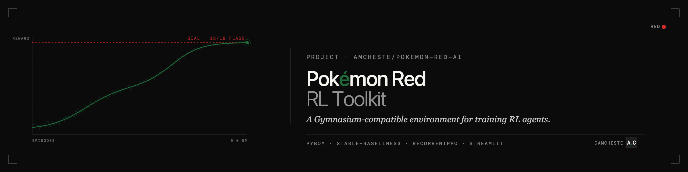

<div align="center">



# Pokémon Red: Reinforcement Learning Toolkit

**A Gymnasium-compatible environment and training pipeline for
*Pokémon Red*, built on PyBoy, Stable-Baselines3, and `sb3-contrib`.**

[](tests/)
[](https://github.com/amcheste/pokemon-red-ai/actions/workflows/test.yml)
[](https://www.python.org/downloads/)
[](LICENSE)
[](#roadmap)

</div>

---

This repository provides everything needed to train RL agents to play
*Pokémon Red*: an emulator-backed Gymnasium environment with three
first-class observation treatments (pixel / symbolic / hybrid),
RecurrentPPO training scripts, an event-flag-based reward calculator
covering 15 critical-path milestones (Boulder Badge path, verified
against the [`pret/pokered`](https://github.com/pret/pokered)
disassembly), live Streamlit monitoring dashboards, configurable
alerts (desktop / Slack / email), and an analysis layer with bootstrap
confidence intervals via
[`rliable`](https://github.com/google-research/rliable).

---

## Demo

> [!NOTE]
> Demo GIF and dashboard screenshot are forthcoming with the EWRL 2026
> pilot run. To regenerate them locally, run the smoketest in
> [Quick start](#quick-start); the agent recording can be captured
> from the PyBoy window and the dashboard screenshot from
> `scripts/monitor.py`.

<div align="center">


<br/><br/>


</div>

---

## What success looks like

The EWRL 2026 pilot grid measures Boulder Badge win-rate over
3 treatments × 3 seeds × 10M env-steps from a fixed Pallet Town save
state.  At 10M steps reaching Brock is a *stretch* goal — we report
the primary metric alongside two informative secondary metrics
(best-episode reward and per-flag first-episode-triggered) to capture
progress that doesn't yet cross the Boulder Badge bar.  Final numbers
will appear in the EWRL 2026 paper once pilots complete; the live W&B
project is the up-to-date source while runs are in flight.

---

## Table of contents

- [Demo](#demo)
- [Repository at a glance](#repository-at-a-glance)
- [System requirements](#system-requirements)
- [Quick start](#quick-start)
- [Full experiments](#full-experiments)
- [Observation treatments](#observation-treatments)
- [Reward function](#reward-function)
- [Statistical analysis](#statistical-analysis)
- [Live monitoring](#live-monitoring)
- [Use as a library](#use-as-a-library)
- [Troubleshooting](#troubleshooting)
- [Running the tests](#running-the-tests)
- [Roadmap](#roadmap)
- [Related work and inspiration](#related-work-and-inspiration)
- [Citation](#citation)
- [Contributing](#contributing)
- [Acknowledgments](#acknowledgments)
- [License and ROM](#license-and-rom)

---

## Repository at a glance

| Path | What's there |
|------|--------------|
| `pokemon_red_ai/environment/` | Gymnasium env wrapping PyBoy + 3 observation treatments |
| `pokemon_red_ai/training/` | RecurrentPPO trainer, callbacks (W&B, alerts, monitoring) |
| `pokemon_red_ai/analysis/` | Treatment-comparison logic (`comparison.py`) |
| `scripts/train.py` | Primary training entry point |
| `scripts/eval.py` | Deterministic evaluation harness |
| `scripts/analyze.py` | rliable bootstrap analysis → publication-quality figures |
| `scripts/compare.py` | Streamlit dashboard for side-by-side run comparison |
| `scripts/monitor.py` | Streamlit dashboard for live single-run monitoring |
| `scripts/run_pilots.sh` | Launch a multi-treatment / multi-seed run grid |
| `scripts/verify_event_flag_ids.py` | Re-verify event flag IDs against `pret/pokered` |
| `docs/research_playbook.md` | Step-by-step operational guide for long-running experiments |
| `docs/testing_roadmap.md` | Tiered acceptance / regression testing plan |
| `tests/` | Unit + integration tests (pytest; run `pytest tests/` for the live count) |

---

## System requirements

| Resource | Minimum | Recommended |
|----------|---------|-------------|
| OS | macOS or Linux | macOS 13+ or Ubuntu 22.04+ (Windows untested) |
| Python | 3.10 | 3.12 |
| RAM | 8 GB | 16 GB |
| Disk | 1 GB (code + ROM + a few checkpoints) | 50 GB (a full pilot grid keeps every checkpoint) |
| Accelerator | CPU works for smoketests | NVIDIA CUDA GPU or Apple Silicon (MPS) for the full pilot grid |
| ROM | Legal copy of Pokémon Red (`.gb`) | — (see [License and ROM](#license-and-rom)) |

CI tests the project on Python 3.10 / 3.11 / 3.12 on `ubuntu-latest`.

---

## Quick start

Five minutes from clone to a verified training pipeline.

```bash
# 1. Install
git clone https://github.com/amcheste/pokemon-red-ai.git
cd pokemon-red-ai
python3 -m venv venv && source venv/bin/activate
pip install -r requirements.txt
pip install -e .

# 2. Generate save states (one-time; requires a legal Pokémon Red ROM)
python3 scripts/create_save_states.py --rom path/to/PokemonRed.gb

# 3. Smoke test (~5 min, verify the pipeline end-to-end)
python3 scripts/train.py \
    --rom path/to/PokemonRed.gb \
    --save-state save_states/s0_post_intro.state \
    --observation-type pixel --total-timesteps 50000 --seed 42 \
    --save-dir ./training_output/smoketest
```

If the smoketest exits cleanly and your W&B project shows the run,
the pipeline is ready for [full experiments](#full-experiments).

---

## Full experiments

The canonical 9-pilot grid (3 treatments × 3 seeds × 10M env-steps)
is the EWRL 2026 paper's main result.  On an Apple M3 Max with
3-pilot concurrency it takes ~33 hours wall-clock; see
[`docs/research_playbook.md`](docs/research_playbook.md) for the
operational playbook, compute estimates, and cloud-compute
alternatives.

```bash
# Launch the 9-pilot grid (caffeinate-wrapped on macOS)
scripts/run_pilots.sh --rom path/to/PokemonRed.gb --parallel 3

# Generate publication-quality figures (IQM + 95% CIs via rliable)
python3 scripts/analyze.py --results-dir ./training_output \
    --output-dir ./figures --format pdf --reps 10000
```

For unattended overnight runs, configure desktop / Slack / email
alerts:

```bash
cp configs/alerts.example.yaml configs/alerts.yaml   # then enable channels
```

---

## Observation treatments

Three encoder paths, all feeding into the same LSTM (hidden size 256)
and PPO policy / value heads (`pi=[256,128]`, `vf=[256,128]`).
Selected via `--observation-type` on `scripts/train.py`.

| Treatment | Observation | Encoder | Params | Feature dim |
|-----------|-------------|---------|--------|-------------|
| `pixel`   | 80×72×1 grayscale Game Boy screen | NatureCNN ([Mnih et al. 2015](https://www.nature.com/articles/nature14236)), `features_dim=256` | ~564K | 256 |
| `symbolic` | Player position, party stats, 18-slot flag bit-vector (15 active flags from the pre-registered set), exploration counters (29 features total) | 3-layer MLP `29 → 640 → 640 → 256` | ~594K | 256 |
| `hybrid`  | `pixel` ∪ `symbolic` streams | NatureCNN(256) + symbolic MLP(256), concatenated | ~1.16M | 512 |

The pixel and symbolic encoders are sized to within 10% on trainable
parameter count to neutralize the encoder-capacity confound when
comparing modalities (Henderson et al. 2018; Engstrom et al. 2020;
Andrychowicz et al. 2021). Strict per-forward FLOP matching across CNN
and MLP architectures distorts encoder design and is reported
transparently rather than enforced. Per-condition learning rates are
selected from a pre-registered log-uniform grid following Eimer et al.
(2023).

Run [`scripts/check_encoder_capacity.py`](scripts/check_encoder_capacity.py)
to print the exact parameter / FLOP table and assert the 10% match
constraint (exits non-zero on violation; the assertion is also wired
into CI).

Implementation:
[`pokemon_red_ai/training/models.py`](pokemon_red_ai/training/models.py);
observation construction in
[`pokemon_red_ai/environment/observations.py`](pokemon_red_ai/environment/observations.py).

The package also ships three legacy observation types
(`multi_modal`, `screen_only`, `minimal`) for backward compatibility
with earlier scripts.

## Reward function

The default `events` reward strategy uses a configurable set of 15
event flags between Pallet Town and the Boulder Badge.  Each flag
transition 0 → 1 awards a fixed positive reward exactly once per
episode.  A small per-step time penalty, a new-map discovery bonus,
and a party-faint penalty are also active by default.

Four other reward strategies are available
(`standard` / `exploration` / `progress` / `sparse`); see
[`pokemon_red_ai/environment/rewards.py`](pokemon_red_ai/environment/rewards.py)
for the full menu and configuration knobs.

The flag list with bit offsets is in
[`pokemon_red_ai/game/event_flags.py`](pokemon_red_ai/game/event_flags.py),
and is re-verified against the canonical `pret/pokered` disassembly
on every CI build by
[`scripts/verify_event_flag_ids.py`](scripts/verify_event_flag_ids.py).

## Statistical analysis

Following [Agarwal et al. 2021, *Deep Reinforcement Learning at the
Edge of the Statistical Precipice*](https://arxiv.org/abs/2108.13264),
the analysis tooling reports:

- **Point estimate:** interquartile mean (IQM) over per-seed scores.
  Robust to outlier seeds in either tail.
- **Uncertainty:** 95% percentile bootstrap with 2,000 resamples.
- **Pairwise comparison:** probability of improvement,
  `Pr[score_A > score_B]` via stratified bootstrap.

Implemented in [`scripts/analyze.py`](scripts/analyze.py) (post-hoc
figures) and
[`pokemon_red_ai/analysis/comparison.py`](pokemon_red_ai/analysis/comparison.py)
(reusable backend for the live Streamlit comparison and any notebook
work).

## Live monitoring

| Tool | Use case |
|------|----------|
| Weights & Biases (auto-enabled in `train.py`) | Cloud telemetry; per-treatment run grouping; check from any device |
| `streamlit run scripts/monitor.py` | Single-run live dashboard: reward curves, event flags, maps, level / party / money |
| `streamlit run scripts/compare.py` | Multi-run comparison: IQM table, learning-curve overlays with 95% bands, milestone race |
| `pokemon_red_ai.training.alerts` | Desktop / Slack / email alerts on first badge, reward plateau, training crash |

## Use as a library

The training pipeline is fully usable outside the bundled scripts:

```python
from pokemon_red_ai.environment import PokemonRedGymEnv
from sb3_contrib import RecurrentPPO

env = PokemonRedGymEnv(
    rom_path="PokemonRed.gb",
    observation_type="hybrid",
    reward_strategy="events",
    max_episode_steps=15_000,
)
model = RecurrentPPO("MultiInputLstmPolicy", env, verbose=1)
model.learn(total_timesteps=1_000_000)
```

Custom reward strategies, observation types, and callback chains are
documented in [`DEVELOPER_GUIDE.md`](DEVELOPER_GUIDE.md).

## Troubleshooting

| Symptom | Cause | Fix |
|---------|-------|-----|
| `ModuleNotFoundError: No module named 'sdl2'` at import | PyBoy hard-requires SDL2 system libraries | macOS: `brew install sdl2`. Ubuntu: `sudo apt install libsdl2-2.0-0`. The Python `pysdl2-dll` package usually handles bundled binaries on macOS. |
| `pyboy.PyBoy: Failed to load ROM` | ROM path wrong, or a non-canonical dump | Verify the path. Pass `--rom-sha256 <hash>` to `scripts/train.py` for strict checking. The actual hash is always logged for the reproducibility appendix. |
| `wandb: ERROR Unable to authenticate` | No W&B API key | `wandb login` (paste from <https://wandb.ai/authorize>), or pass `--no-wandb` to train without telemetry. |
| `RuntimeError: ... is a nondeterministic algorithm` on MPS during eval | `torch.use_deterministic_algorithms(True)` doesn't cover all MPS kernels | Mitigated by `warn_only=True` in `scripts/seed_utils.seed_everything`; MPS won't crash but determinism may be partial. For paper-grade eval, prefer CPU or CUDA. |
| Streamlit dashboard shows "no data" | `scripts/monitor.py` pointed at the wrong `--runs-dir` | Pass `--runs-dir ./training_output` (or wherever your `--save-dir` from `train.py` lives). |
| Training is much slower than `compute_plan.md` expects | Likely `n_envs=1` (DummyVecEnv); each PyBoy instance is single-threaded | Add `--n-envs 4` to saturate P-cores on M3 Max; tune higher on cloud high-CPU instances. |

For anything else, open a
[bug report](https://github.com/amcheste/pokemon-red-ai/issues/new/choose).

## Running the tests

```bash
./venv/bin/python3 -m pytest                       # full suite
./venv/bin/python3 -m pytest tests/unit/           # unit only
./venv/bin/python3 -m pytest tests/integration/    # determinism, reward, schema, perf
./venv/bin/python3 -m pytest -k comparison         # specific module
```

The same suite runs on every push via GitHub Actions
(`.github/workflows/test.yml`) on Python 3.10 / 3.11 / 3.12, plus a
separate job that re-verifies the event flag IDs against the live
`pret/pokered` disassembly.

---

## Roadmap

This codebase is the engine for a planned 3-paper research cascade on
observation representations in long-horizon, sparse-reward RL.

| Milestone | Target | Status |
|-----------|--------|--------|
| **M2** | EWRL 2026 workshop submission — capacity-matched pixel vs symbolic vs hybrid pilot | In progress; pilot infrastructure complete, runs launching post-audit |
| **M3** | PokeGym public release on PyPI | Planned, post-EWRL |
| **M4** | NeurIPS 2026 workshop — 750M+ env-step main result, 5 seeds × 3 treatments | Planned |
| **M5** | TMLR campaign — full ablation set, generalization test, ~4.2B env-step budget | Planned |

Compute estimates, milestone exit criteria, and a per-step operational
playbook are in
[`docs/research_playbook.md`](docs/research_playbook.md).  The tiered
testing plan tracking future regression / acceptance work lives in
[`docs/testing_roadmap.md`](docs/testing_roadmap.md).

## Related work and inspiration

This project stands on the shoulders of an active open-source Pokémon
RL community.  We're directly inspired by, and want to credit, two
projects in particular:

- **[PWhiddy/PokemonRedExperiments](https://github.com/PWhiddy/Pokemon-Red-Experiments)** —
  the canonical PPO-with-exploration baseline that demonstrated
  Pokémon Red was a tractable long-horizon RL benchmark.  Their
  exploration-reward design influenced our event-flag reward
  calculator, and their progress visualizations inspired the live
  Streamlit monitor here.
- **[drubinstein/pokemonred_puffer](https://github.com/drubinstein/pokemonred_puffer)** —
  the PufferLib-accelerated port.  Their throughput results are what
  pushed us to take parallel-env training seriously enough to land
  `--n-envs` with rank-aware seeding.

Where this project goes further:

- **Capacity-matched modality comparison** (pixel vs symbolic vs
  hybrid) at <10% trainable-parameter gap, with rliable IQM and 95%
  CIs.  The central scientific question of the paper.
- **Pre-registered analysis plan** + compute ledger + CI-gated
  invariants (event flag IDs locked against `pret/pokered`, encoder
  fairness asserted on every push, full seeding-chain determinism
  tested end-to-end).
- **Reproducibility plumbing**: ROM SHA-256 verification,
  deterministic eval harness, frozen-result paper artifact in a
  separate sibling repo.

If you want a fast baseline, start with one of the projects above.
If you want a paper-grade controlled experiment with an audit trail,
this is the toolkit.

## Citation

If you use this toolkit in your research, please cite:

```bibtex
@misc{chester2026symbols,
  title  = {Symbols or Pixels? A Controlled Study of Observation
            Representations in Long-Horizon Reinforcement Learning},
  author = {Chester, Alan},
  year   = {2026},
  url    = {https://github.com/amcheste/pokemon-red-ai}
}
```

A DOI badge will appear here once a tagged release is published via
Zenodo — see
[GitHub's archiving guide](https://docs.github.com/en/repositories/archiving-a-github-repository/referencing-and-citing-content)
to set up the integration on this repo.

## Contributing

Contributions welcome — bug reports, fixes, additional observation
treatments, reward strategies, callbacks, documentation improvements.
See [`CONTRIBUTING.md`](CONTRIBUTING.md) for development setup, branch
conventions, and reproducibility expectations.  By participating you
agree to the [Code of Conduct](CODE_OF_CONDUCT.md).

## Acknowledgments

Built on [PyBoy](https://github.com/Baekalfen/PyBoy) (Game Boy
emulation),
[Stable-Baselines3](https://github.com/DLR-RM/stable-baselines3) and
[`sb3-contrib`](https://github.com/Stable-Baselines-Team/stable-baselines3-contrib)
(RL algorithms),
[Gymnasium](https://github.com/Farama-Foundation/Gymnasium) (RL
interface), and
[`rliable`](https://github.com/google-research/rliable) (statistics).
Memory addresses and event-flag IDs are verified against the
[`pret/pokered`](https://github.com/pret/pokered) disassembly.

## License and ROM

The code is MIT-licensed — see [LICENSE](LICENSE).  **Free for
research and commercial use** with attribution.

You must provide your own legal copy of the Pokémon Red ROM.  This
repository does not distribute, link to, or facilitate acquisition
of any copyrighted game data.
